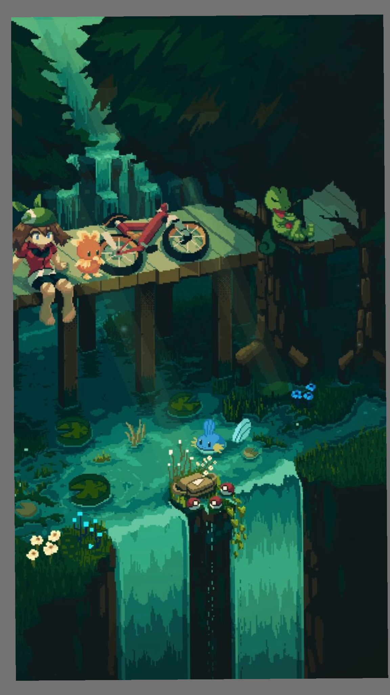

<h1 align="center">Hi 👋, I'm AP</h1>
<h3 align="center">#Please excuse me for being antisocial 🙏</h3>

<!-- === Layout Section === -->

  <table>
    <tr>
      <!-- Cột bên trái: đoạn giới thiệu -->
      <td align="left" width="60%">
        

          🌱 I’m currently learning <b>Python, Java, C++, ...</b>  
          📫 How to reach me: <b>an0915129080@gmail.com</b>  
          💬 I love coding, gaming, and exploring new technologies!  
          ☕ Usually working with a cup of coffee by my side.
        

      </td>

      <!-- Cột bên phải: ảnh -->
      <td align="right" width="40%">
        
      </td>
    </tr>
  </table>

